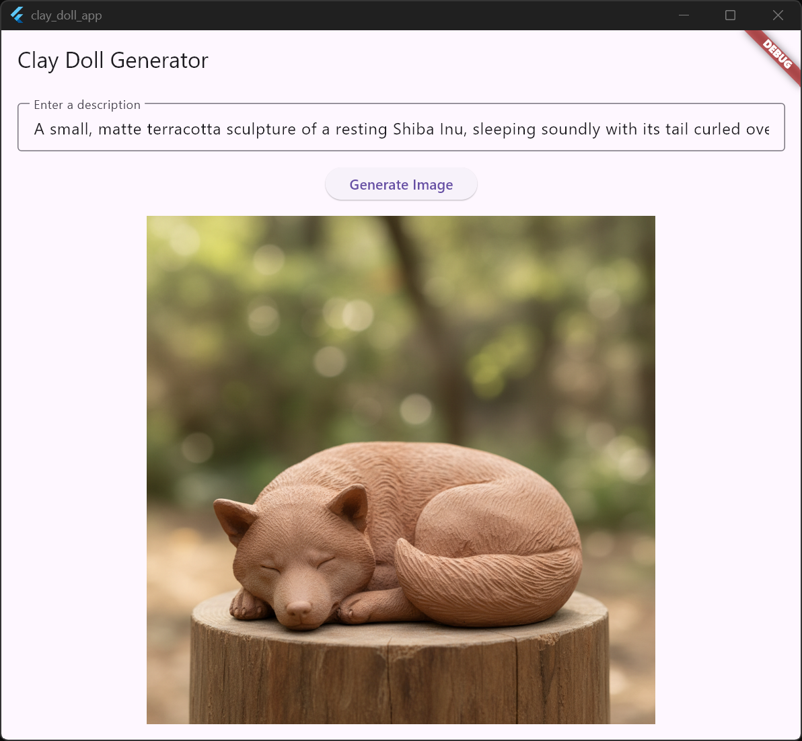
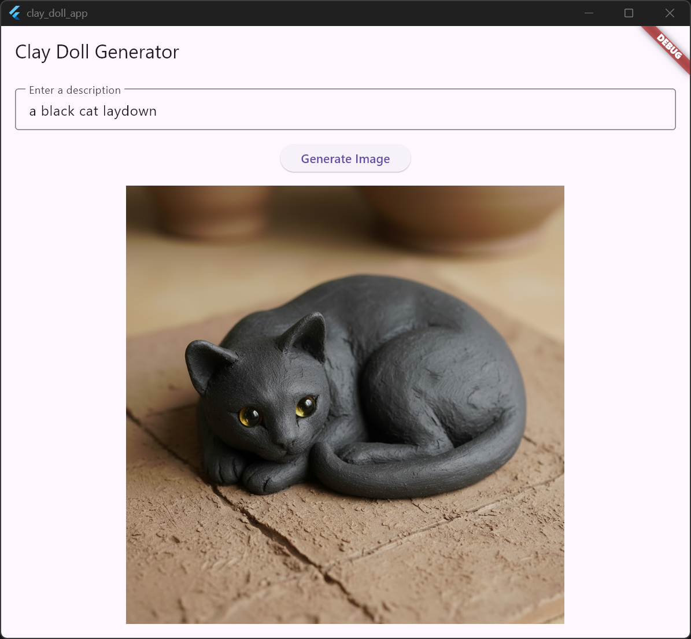

# Clay Doll Generator

This project is a full-stack application that allows users to generate images of clay dolls based on a text prompt. It consists of a Flutter application for the user interface and a Python-based backend that uses a generative AI model to create the images.

## Features

*   **Text-to-Image Generation:** Generate clay doll images from text descriptions.
*   **Flutter Web App:** A user-friendly interface built with Flutter.
*   **Python Backend:** A FastAPI backend to handle image generation requests.
*   **Dockerized:** The entire application is containerized using Docker and Docker Compose for easy setup and deployment.

## Project Structure

The project is divided into two main components:

*   `clay_doll_app/`: The Flutter application that provides the user interface.
*   `clay_doll_agent/`: The Python FastAPI backend that serves the image generation agent.

## Getting Started

### Prerequisites

*   [Docker](https://docs.docker.com/get-docker/)
*   [Docker Compose](https://docs.docker.com/compose/install/)
*   [Flutter SDK](https://flutter.dev/docs/get-started/install) (for local development)
*   [Python 3.10+](https://www.python.org/downloads/) (for local development)

### Installation

1.  **Clone the repository:**
    ```bash
    git clone <repository-url>
    cd clay_doll
    ```

2.  **Set up environment variables:**
    Create a `.env` file in the `clay_doll_agent/` directory and add your Google API key:
    ```
    GOOGLE_API_KEY=your_google_api_key
    ```

### Running with Docker

To run the application using Docker, execute the following command from the root of the project:

```bash
docker-compose up --build
```

This will build the Docker images for both the Flutter app and the Python backend and start the services.

*   The Flutter web app will be available at [http://localhost:8080](http://localhost:8080).
*   The FastAPI backend will be running at [http://localhost:8000](http://localhost:8000).

## Usage

1.  Open your web browser and navigate to [http://localhost:8080](http://localhost:8080).
2.  Enter a text description of the clay doll you want to generate in the input field.
3.  Click the "Generate Image" button.
4.  The generated image will be displayed on the screen.

## Screenshots



